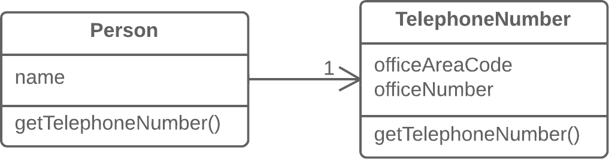

# Code Smells

当我们发现自己的代码有了这些特征，不忍心看第二次，便要考虑进行refactor。此处我们指的是工程代码，可以认为就是基于java的。

## 1. Bloaters

函数、代码段、类（一般是逐渐变得）特别巨大。

### 1.1 long method

超过十行的代码便需要开始考虑是否方法过长；当coder认为需要在方法中间某处添加注释，意味着需要为这一部分代码创建一个新方法。方法名要有一个descriptive name.

解决方法：
1. extract method
2. replace Temp with Query：将临时变量的计算改为进行依次query

```java
double calculateTotal() {
  double basePrice = quantity * itemPrice;
  if (basePrice > 1000) {
    return basePrice * 0.95;
  }
  else {
    return basePrice * 0.98;
  }
}
```

change to 

```java
double calculateTotal() {
  if (basePrice() > 1000) {
    return basePrice() * 0.95;
  }
  else {
    return basePrice() * 0.98;
  }
}
double basePrice() {
  return quantity * itemPrice;
}
```

3. 新的方法参数如果可以合并为一个类，可以合并；或者它们本身就属于一个类，那就传递这个类的对象。（减少参数数量）
4. 如果这个方法中的局部变量彼此依赖严重，可以创建一个辅助类专门用于这个方法的计算。

```java
class Order {
  // ...
  public double price() {
    double primaryBasePrice;
    double secondaryBasePrice;
    double tertiaryBasePrice;
    // Perform long computation.
  }
}
```

change to 

```java
class Order {
  // ...
  public double price() {
    return new PriceCalculator(this).compute();
  }
}

class PriceCalculator {
  private double primaryBasePrice;
  private double secondaryBasePrice;
  private double tertiaryBasePrice;
  
  public PriceCalculator(Order order) {
    // Copy relevant information from the
    // order object.
  }
  
  public double compute() {
    // Perform long computation.
  }
}
```

5. 条件语句一般提示可以extract method：条件本身，每一个分支的计算。【让计算更明确、条件更直观】

```java
if (date.before(SUMMER_START) || date.after(SUMMER_END)) {
  charge = quantity * winterRate + winterServiceCharge;
}
else {
  charge = quantity * summerRate;
}
```

```java
if (isSummer(date)) {
  charge = summerCharge(quantity);
}
else {
  charge = winterCharge(quantity);
}
```

6. loops一般也可以extract method：每一次循环开始可能要做一些准备工作，我们把这一部分提到另一个函数中，使可读性更强，

```java
void printProperties(List users) {
  for (int i = 0; i < users.size(); i++) {
    String result = "";
    result += users.get(i).getName();
    result += " ";
    result += users.get(i).getAge();
    System.out.println(result);

    // ...
  }
}
```

change to

```java
void printProperties(List users) {
  for (User user : users) {
    System.out.println(getProperties(user));

    // ...
  }
}

String getProperties(User user)  {
  return user.getName() + " " + user.getAge();
}
```

优势：
1. 对于OO的代码，方法更短的类更方便使用与维护。
2. 同时可以减少代码的重复。
3. overhead可以完全忽视；同时可以更好地找到bottleneck。


### 1.2 large class

有许多fields/methods/lines的类。一般是在开发中逐渐添加功能到一个类，使得代码越来越大。创建一个新的类看起来总是“更麻烦”的。

解决方法：
1. extract class. 一个类的一部分属性属于一个子功能，将它提取出去。




2. extract subclass. 如果该类的一部分功能仅在某些时候使用（不是一个子功能），可以创建一个子类用于这些场景。

3. extract interface. 
4. GUI的功能和GUI信息的处理，放在不同的类中；两者信息各有一份。

优势：
1. 对于一个类，开发者可以立刻知道它支持的方法

### 1.3 primitive obsession

在开发过程中，偶尔会有一些简单的任务（通常是对一个对象做分类，比如用户是管理员、普通人员），我们会使用一个常量field进行标识；等等直接基于语言提供的原语直接构建完成的业务功能。这一般是偷懒的表现，在项目不断进展的过程中，会越来越难以处理。

解决方法：
1. replace data value with object；若数据用于指示类型，设计一个类型类（State）指示对象类型；或者干脆创建子类。
2. 如果使用了一个array，改成使用一个object


### 1.4 long parameter list

参数比较多，比如超过四个，我们应考虑将一些参数合并为一个类。

1. 有时可能是方法设计的不好，其实只需要一个参数：replace paramter with method call
2. 参数 => 对象

### 1.5 data clumps

工程不同处，出现了相同的fields组合，比如许多类都有数据库的访问操作，都存储了数据库的连接信息。

解决方法：
1. extract class，将repeating data放在一个class中；使用这部分data的方法，改为传递这个对象。

我们希望在refactor之后，对于特定数据的操作都被集中在一处，若有调整也只需要修改这一处。代码量同时减少。

注意：
1. 由传递某些fields改为传递一个对象到另一个类的方法，意味着两个类增加了依赖。（我认为一般情况不需要介意）